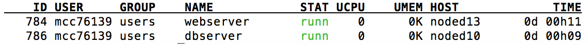
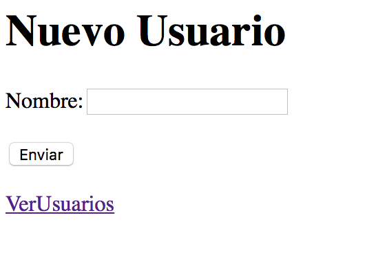
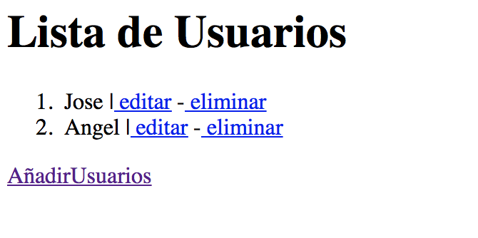
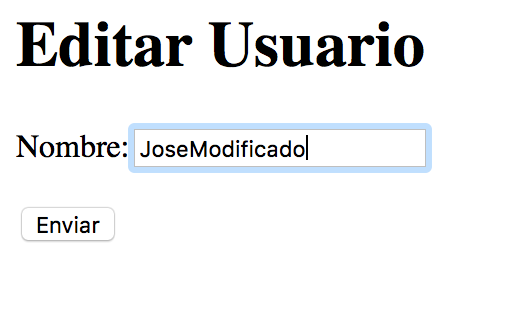
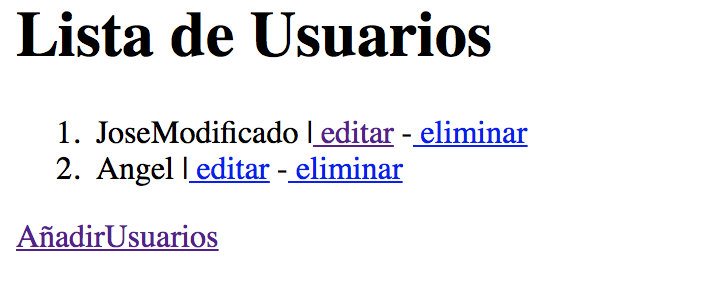

# Práctica 1:

En esta primera práctica es necesario tener dos máquinas virtuales, una con un servidor web y la otra con un servidor de base de datos. Para evitar problemas, crearemos ambas máquinas bajo el mismo sistema operativo Ubuntu 14.04. 

## Creación de las máquinas

* Nos nonectamos a las instancia docker.ugr.es con nuestros credenciales. 

* Creamos una nueva plantilla de ubuntu para ello:

	Obtenemos nuestro id de vnet. 
	
		onevnet list
	
	Obtenemos la lista de imagenes disponibles, nos interesa la ubuntu y guardamos el <ID> para referenciarlo después. 
	
		oneimage list
	
	Creamos la plantilla:
	
		onetemplate create --name "Ubuntu" --cpu 1 --vcpu 1 --memory 512 --arch x86_64 --disk 10 --nic "mcc76139799_vnet" --vnc --ssh --net_context
		
*	El siguiente paso una vez creada las plantillas será crear las máquinas virtuales como tal. Recordemos que necesitamos dos. Para crearlas conectamos a la aplicación web y añadimos dos máquinas virtuales una denominda ``dbserver`` y otra denominada ``webserver``.
* Para ver que están correctamnte instanciadas podremos usar el comando ``onevm list`` que nos ofrecerá el siguiente resultado:

## Provisionamiento de las máquinas virtuales. 

El siguiente paso es provisionar las máquinas virtuales con los apropiados paquetes software que permitan desplegar el servidor de base de datos y el de aplicación. 

Para ello nos conectamos a cada una de las máquinas virtuales por SSH. Para ver nuestra IP asociada a cada una de las máquinas podemos hacerlo mediante el comando: 

	onevm show ID

### Servidor web:

Nuestra aplicación estará basada en NodeJS, Express, Jade (para dar rapidamente forma a los formularios) y por último MongoDB aunque esto lo veremos en el punto del servidor de BD. También necesitaremos instalar Git, ya  que la aplicación será desarrollada en local y llevada a producción a OpenNebula desde este sistema de control de versiones. 

Para instalar Node y Express hemos seguido [este tutorial](https://www.vultr.com/docs/installing-node-js-and-express). También es necesario instalar un servidor web, para ello, hemos utilizado Nginx y concretamente [este tutorial](https://www.digitalocean.com/community/tutorials/how-to-set-up-a-node-js-application-for-production-on-ubuntu-14-04) donde nos indica como conseguir que el Middleware, Express, sirva las aplicaciones a través del servidor web y no con uno propio. Esto tiene grandes ventajas ya que con muy poco más de código podremos hacer que este microframework en conjunción con Nginx se comporte de balanceador de carga dando más robusted a nuestra app. 

El punto primordial de este paso está en hacer que las apps se sirvan por tanto en el puerto 80, para ello en el archivo de configuración de Nginx deberemos tener una estructura como esta:

	server {
	    listen 80;

		    location /ruta_app1 {
		        proxy_pass http://APP_PRIVATE_IP_ADDRESS:PUERTO_APP;
		        proxy_http_version 1.1;
		        proxy_set_header Upgrade $http_upgrade;
		        proxy_set_header Connection 'upgrade';
		        proxy_set_header Host $host;
		        proxy_cache_bypass $http_upgrade;
	    	} 	
	}
	
	
En este fichero podremos ir añadiendo tantas apps como queramos, cada una con su respectiva ruta y puerto únicos. Deberemos tener en cuenta que si en este punto hemos asignado por ejemplo una ruta denominada ``ruta_app``, en cada una de las líneas de código de nuestra aplicación en la que mencionemos una ruta, por ejemplo en los controladores, deberemos añadir esta nueva ruta al inicio sino, obtendremos error 404.

Tras hacer las correspondientes modificaciones en el servidor deberemos reiniciarlo. 

### Servidor Mongo

La persistencia la implementaremos con una base de datos MongoDb muy sencilla, compuesta de una sola colección. Para instalar Mongo, nos conectamos a la máquina virtual que hará las veces de servidor de BD y seguimos el [siguiente tutorial](https://docs.mongodb.com/manual/tutorial/install-mongodb-on-ubuntu/). 

Tras esto deberemos crear el directorio que por defecto mongo usa para almacenar los datos:

	sudo mkdir -p /data/db/

Y por último ejecutamos el servicio:

	mongod &	

## App en producción. 

### Configuración en la app:

Este paso es el más delicado ya que implica la conexión de ambas máquinas virtuales y sistemas. 

Entramos en la máquina virtual que hará las veces de servidor de apps y concretamente al directorio donde tenemos nuestra app, para ello, deberemos haber hecho un clone de nuestro repositorio en Github. Una vez dentro, instalaremos todas las dependencias:

	npm install 
	
Tras esto deberemos localizar en el fichero ``models/index.js`` que se encarga de la conexión con la base de datos y concretamente esta línea:

  	mongoose.connect('mongodb://IP/' + dbName);
  	
Deberemos sustituir esa línea por el nombre de nuestra base de datos y la IP por la IP de nuestro servidor de BD.  

### Configuración en el Servidor BD:

Deberemos permitir conexiones del exterior al puerto que utiliza MongoDB. Para ello, mediante IPTABLES procedemos como sigue:

	iptables -A INPUT -s IP-WEBSERVER -p tcp --destination-port 27017 -m state --state NEW,ESTABLISHED -j ACCEP

	iptables -A OUTPUT -d IP-WEBSERVER -p tcp --source-port 27017 -m state --state ESTABLISHED -j ACCEPT	
	
	
Tras esto deberemos acceder de nuevo a nuestro servidor de apps, y ejecutar nuestra aplicación con el comando:

	node app.js
	
Tras lo cual si todo ha ido correctamente la aplicación comenzará a ejecutarse sin problemas. 		

## Aplicación web

La aplicación web más que una aplicacion es un módulo o componente que podria incluirse dentro de otra aplicación mayor fácilmente. Implementa un sistema de control de usuarios CRUD.

La aplicación está desarrollada con Node, y utiliza el modelo vista controlador mediante plantillas y un diseño modular que permite que esta sea fácilmente extensible. Por ejemplo si quisieramos llevarnos el módulo CRUD desarrollado a otra aplicación, solo tendríamos que llevarnos la carpeta ``users`` ubicada dentro de ``controllers`` a nuestra nueva app, cargar el módulo en el archivo ``app.js`` correspondiente y si el modelo de la base de datos y conexión están creadas funcionaría perfectamente. 

Respecto a la base de datos creada solo tenemos una colección denominada usuarios y con un solo campo (nombre).

### Funcionamiento de la app:

* La primera vista que encontramos al acceder a la app es la de añadir un nuevo usuario que también nos ofrece la posibilidad de acceder a la vista de la lista de usuarios en el sistema. 

* La segunda vista que nos encontramos nos permite listar y eliminar los usuarios incluidos en la base de datos. 

* Si pulsamos sibre editar podremos editar el usuario sobre el que hemos pulsado.

* Tras lo cual tras pulsar sobre enviar podremos ver que este ha sido modificado. 

			