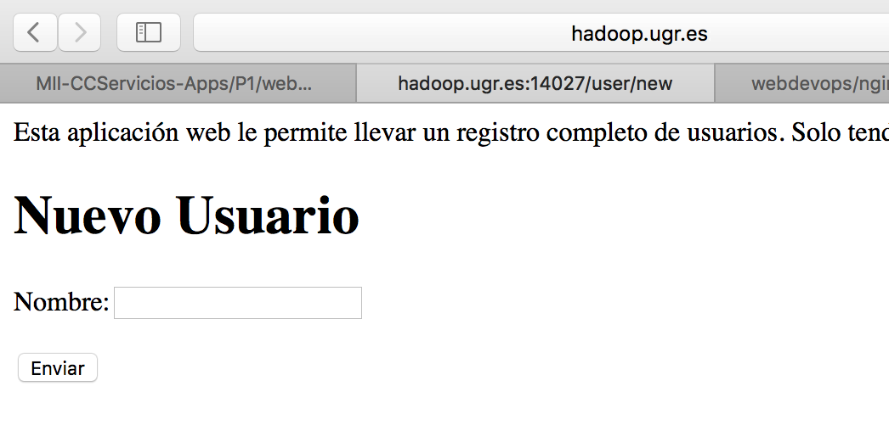

# Práctica 2

## Enunciado y objetivos

En esta práctica se estudiaran los PaaS. Se desarrollaran actividades relacionadas con contenedores y la gestión de los mismos con los siguientes objetivos. 

1. Crear un contenedor docker (A) con APACHE, SSL, y PHP5.
	
	a. ¿Cuál es el puerto SSL?
	
	b. ¿Cómo redirigir el puerto SSL a vuestro puerto asignado?
	
2. Crear un contenedor docker (B) con MySQL

3. Crear una página en el servidor Web (A) que se conecte al servicio MySQL en el contenedor (B)

4. Duplicar los contenedores A y B y discutir o mostrar qué pasaría si uno de ellos cayese.

5. Desplegar un servicio OwnCloud o NewCloud en otro contenedor (o eliminar alguno de los ya utilizados) y chequear su correcto funcionamiento almacenando archivos.

6. Elaborar un breve documento detallando el todo trabajo realizado.

## Conexión

Para conectar:

	ssh usuario@hadoop.ugr.es 

Para comprobar que docker funciona correctamente podemos usar:

	docker run hello-world
	

# Creación de los contenedores

## Contenedores para alojar las apps

Como la aplicación realizada en la práctica anterior está basada en Node y Express, hemos bajado la siguiente imagen de [Docker Hub](https://hub.docker.com/_/node/), que contiene todo lo necesario para ejecutar nuestra app, a excepción de Express que deberemos instalar. Para ello el primer paso es obtener la imagen:
	
	docker pull node
	
	
Dado que también necesitaremos un servidor web, y los contenedores deben tener tendencia a ser lo más ligeros posibles crearemos otro contenedor con Nginx como servidor web al que llegarán las peticiones, esto hace que con lago más de código este contenedor haga las veces de balanceador de carga y ofrezca más robusted al sistema, aunque nosotros no lo implementaremos, si que lo dejaremos conectado para posibles futuras inclusiones. Lo primero que hacemos es obtener el contenedor. 

	docker pull webdevops/nginx 
	

## Contenedor para alojar la base de datos

La base de datos que hemos utilizado en la anterior práctica es MongoDB. En Docker Hub tenemos varios contenedores que pueden servirnos para montar esta base de datos como por ejemplo [este](https://hub.docker.com/r/mvertes/alpine-mongo/). Tras localizar el que nos es útil, solo tenemos que hacer pull. 

	docker pull  mvertes/alpine-mongo

# Configuración 

El primer paso será crear y ejecutar el servidor mongo, como en su propia página en DockerHub indican, esta imagen ya lleva el puerto 27017 abierto por lo que no tendremos nada más que hacer lo siguiente:

	docker run -d --name databasejose mongo mvertes/alpine-mongo
	
Ahora tendremos que crear un contenedor con node y hacer un link a la base de datos mongo creada, para que se conecten correctamente. También deberemos hacer que el puerto 3000 donde correrá la app sea visible para ello podemos usar el comando:

	 docker run -d --name appserverjose --expose 3000 --link=databasejose:mongodb -it node

Por último debemos enlazar el servidor web a nuestro servidor de apps, y dejar abierto el puerto 80 al exterior para poder acceder por el navegador a nuestras apps una vez hayamos generado el proxy reverso. Para ello lo primero es crear el contenedor:

	docker run -d --name webserverjose -p=14027:80 --link appserverjose:appserverjose webdevops/nginx  
	
**Respecto a la pregunta planteada al inicio de la práctica, el servicio ssl escucha en el puerto 443.**
	
Una vez hecho esto debemos acceder a nuestros contenedores, e instalar antes de nada herramientas básicas como git o un editor, como por ejemplo vim. Una vez realizada la configuración que veremos en los puntos siguientes tendremos una estructura parecida a la que podemos ver en la siguiente imagen. 

## Configuración del servidor web

Accedemos a nuestro servidor web con el comando:

 	docker exec -i -t webserverjose /bin/bash 
 	
Tras ello localizamos el archivo ``/etc/nginx/nginx.conf`` y añadimos el siguiente contenido:

	server {
    listen 80;

	    location /{
	        proxy_pass http://appserverjose:3000;
	        proxy_http_version 1.1;
	        proxy_set_header Upgrade $http_upgrade;
	        proxy_set_header Connection 'upgrade';
	        proxy_set_header Host $host;
	        proxy_cache_bypass $http_upgrade;
    	} 	
	}

En este fichero, encontraremos también las siguientes líneas que cargan un fichero de configuración de unos servidores previamente diseñados en el contenedor que harán que el nuestro no funcione. Para ello una vez localizadas **debemos comentarlas**. 

		include /etc/nginx/conf.d/*.conf;
    	include /etc/nginx/sites-enabled/*;
	
Finalizado este punto, reiniciamos el servidor web y accedemos al contenedor que alojará la app. 

## Configuración del servidor de apps

Lo primero que debemos hacer es un clone de [nuestro repositorio](https://github.com/joseangeldiazg/MII-CCServicios-Apps/tree/master/P1/webapp) en GitHub donde encontramos la app. 

Accedemos a esta, instalamos las dependencias con ``npm install`` y editamos el fichero ``controllers/user/index.js`` donde cambiaremos las rutas a las que hayamos puesto en nuestro server dentro de la configuración de Nginx. Una vez hecho esto, debemos cambiar en nuestro fichero de conexión a la base de datos MongoDB la direccion de nuestra base de datos, que en lugar de Localhost será la direccion IP de nuestro contenedor de BD. Si lo desconocemos podemos usar el siguiente comando:

	cat /etc/hosts
	env | grep MONGODB
	
Donde podremos ver el siguiente dato:

	MONGODB_PORT_27017_TCP_ADDR=172.17.0.185
	
Esa IP será la que pasaremos a **Mongoose** para conectar. 	

## Comprobación de uso y funcionalidad

Una vez hecho todo esto, ejecutamos nuestra app en el servidor de apps y accedemos a nuestro servidor web, (hadoop.ugr.es/14027) donde tendremos nuestra app corriendo de la siguiente manera:

	
* [hadoop.ugr.es/14027/user](hadoop.ugr.es/14027/user)

Interfaz para listar los usuarios añadidos a la base de datos. Si editamos o eliminamos nos abrirá las ventanas correspondientes.

* [hadoop.ugr.es/14027/user/new](hadoop.ugr.es/14027/user/new)

Interfaz para añadir un nuevo usuario. 

# Robustez de los servicios

En la práctica se propone duplicar los contenedores de servidor de apps y el de base de datos y discutir o mostrar qué pasaría si uno de ellos cayese. Aunque no se han duplicado, el tener replicada la información y los servicios entre contenedores, además de haber dado un servidor web que se encarga de servir las aplicaciones en un contenedor a parte, harían que el servicio fuera muy robusto y tolerante a caídas de manera que si uno de los servidores de apps cayera se podría servir directamente desde el otro sin que el usuario final notara la caída. 

# Servidor ownCloud en Docker

Para favorecer la robusted del servidor ownCloud, en lugar de montar la base de datos para persistencia en el mismo contenedor donde alojaremos ownCloud, montaremos un servidor de BD PostgreSQL por lo que nuestra arquitectura será la que podemos ver en la siguiente imagen:

Como el servidor ownCloud se conectará al de PostgreSQL, tendremos que crear este primero. Para ello: miraremos en DockerHub una imagen de PostgreSQL que se adapte a nuestros requerimientos como por ejemplo [esta](https://hub.docker.com/_/postgres/) y ejecutamos los siguientes comandos para hacernos con la imagen y ponerla en producción. 

	docker pull postgres
	
	docker run --name owncloud-postgres-jose -e POSTGRES_PASSWORD=pass -d postgres
	
Con esto tendremos lista nuestra base de datos, por lo que ahora deberemos crear el servidor ownCloud. Para ello solo tendremos que ejecutar el siguiente comando que ejecuta la imagen y la conecta con el contenedor de la base de datos. 

	docker run -d  --link owncloud-postgres-jose:owncloud-db --name owncloudserverjose -p 14028:80 owncloud
	
Una vez hecho esto ya podremos acceder a nuestro servidor ownCloud y configurarlo. Para ello accedemos a [hadoop.ugr.es/14028](hadoop.ugr.es/14028) y creamos una nueva cuenta de administrador. Cuando llegue el momento de configurar la base de datos introduciremos los siguientes datos:

* user: postgres
* pass: contraseña dada al crear el contenedor
* database: postgres
* host: owncloud-db

Una vez hecho todo esto podremos ver que nuestro ownCloud está funcionando correctamente. 

