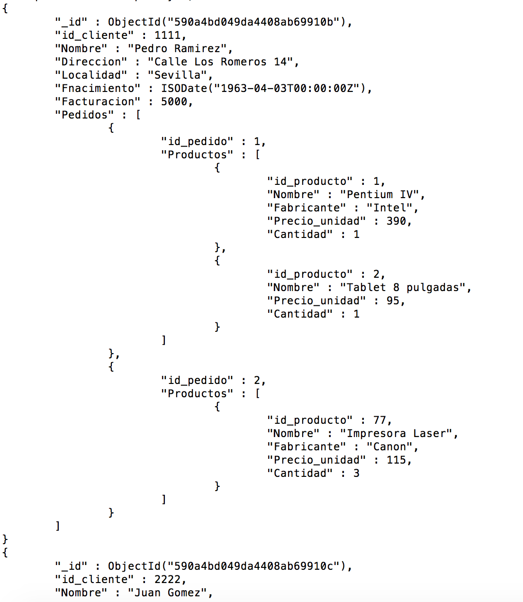

# Práctica 3

## Enunciado y objetivos

El objetivo de esta práctica es familiarizarse con el uso de un sistema de gestión de bases de datos en entornos Big Data. Para ello, haremos uso de la base de datos noSQL más conocida como es, MongoDB.

## Creación del contenedor Docker con MongoDB

Nos decantamos por la imagen de ``mvertes/alpine-mongo`` ya que es mucho más ligera que otras como la oficial de MongoDB.

	docker run -d --name mongo-p4-jose -p 14029:27017 -v /tmp/mongo/insertar_pedidos.js:/home/insertar_pedidos.js mvertes/alpine-mongo

Una vez creado el contenedor conectamos a el siguiente comando:

	docker exec -ti mongo sh
	
Una vez dentro debemos iniciar la consola de MongoDb para ello, simplemente introducimos en la terminal ``mongo``. Por último para cargar la colección de prueba que usaremos introducimos el siguiente comando:

	load('/home/insertar_pedidos.js');
	

## Objetivo 1

Crear la colección pedidos en cada BD asociada a vuestro usuario, sobre la que se realizarán diversas operaciones CRUD. Para crear la colección abre y ejecuta el script ``insertar_pedidos.js`` (accesible en ``/tmp/mongo``). Las tareas a realizar son las siguientes:


### 1- Visualiza la colección pedidos y familiarízate con ella. Observa los distintos tipos de datos y sus estructuras dispares.

		db.pedidos.find().pretty();
		
Esto nos ofrecerá la siguiente salida, donde podemos apreciar la coleccion pedidos, compuesta de **documentos** clientes, que a su vez pueden contener pedidos, que vuelve a ser un **documento**  y a su vez se compone de Productos. 
	

### 2-  Visualiza sólo el primer documento de la colección. Utiliza los métodos ``.limit()`` y ``.findOne()``.

	db.pedidos.findOne();
	
	db.pedidos.find().limit(1).pretty();

``Limit`` funciona de manera similar a SQL y findOne() podemos compararlo con ``SELECT TOP 1 FROM...``		

### 3- Visualiza el cliente con id_cliente = 2222

	db.pedidos.find({id_cliente: 2222}).pretty();
	
Para simular la clausula WHERE de SQL, introduciremos las restricciones dentro de llaves en la instrucción ``find``. 	

### 4- Visualiza los clientes que hayan pedido algún producto de más de 94 euros.

	db.pedidos.find({"Pedidos.Productos.Precio_unidad":{$gt:94}}).pretty();
		
Como vemos es más sencillo que SQL, ya que en ese caso tendríamos que haber realizado reuniones por claves entre tablas para haber obtenido todo. 

5. Visualiza los clientes de Jaén o Salamanca (excluye los datos de los pedidos). Utiliza los operador ``$or e $in``

6. Visualiza los clientes no tienen campo pedidos.

7. Visualiza los clientes que hayan nacido en 1963.

8. Visualiza los clientes que hayan pedido algún producto fabricado por Canon y algún producto cuyo precio sea inferior a 15 euros

9. Datos personales (id_cliente, Nombre, Direccion, Localidad y Fnacimiento) de los clientes cuyo nombre empieza por la cadena "c" (No distinguir entre mayusculas y minúsculas).

10. Visualiza los datos personales de los clientes (excluyendo _id). Limita los documentos a 4.

11. Ídem anterior pero ordenando los documentos por Localidad (ascendente) e id_cliente (descendente).

## Objetivo 2

A partir de la colección pedidos utilizaremos consultas más complejas por medio de los operadores de agregación (pipeline). Por facilidad se indica la consulta en formato SQL estándar. Las tareas a realizar en este caso obtener:

1. No total de clientes:
	
		SELECT COUNT(*) "NUMERO DE CLIENTES" FROM pedidos;
	
2. No total de clientes de Jaén:

		SELECT COUNT(*) "NUMERO DE CLIENTES" FROM pedidos WHERE Localidad = "Jaen";
		
3. Facturación total clientes por localidad

		SELECT Localidad, SUM (Facturacion) "TOTAL" FROM pedidos GROUP BY Localidad;

4. Facturación media de clientes por localidad para las localidades distintas a "Jaen" con facturación media mayor de 5000. Ordenación por Localidad descendente. Eliminar el _id y poner el nombre en mayúsculas.

		SELECT Localidad, AVG (Facturacion) "FACTURACION MEDIA" FROM pedido WHERE Localidad <> "Jaen" GROUP BY Localidad HAVING AVG (Facturacion) > 5000 ORDER BY Localidad ASC;
		
5. Calcula la cantidad total facturada por cada cliente (uso de “unwind”)

		SELECT id_cliente "IDENTIFICADOR", nombre "NOMBRE COMPLETO", SUM (Precio_unidad * Pedidos) "TOTAL CLIENTE" FROM pedidos GROUP BY id_cliente, nombre ORDER BY 2 DESC
		
		
## Objetivo 3

Vamos a utilizar la base de datos libre GeoWorldMap de GeoBytes. Es una base de datos de países, con sus estados/regiones y ciudades importantes. Sobre esta Base de datos vamos a obtener el par de ciudades que se encuentran más cercanas en cada país, excluyendo a los EEUU.

Vamos a importar en nuestra BD de MongoDB un archivo con 37245 ciudades del mundo que está en formato csv (``/tmp/mongo/Cities.csv``):

		mongoimport -u <user> -p <clave> --db <bd> --collection cities --type csv --headerline --file /var/tmp/Cities.csv


Las tareas a realizar en este caso son las siguientes:

1. Encontrar las ciudades más cercanas sobre la colección recién creada mediante un enfoque MapReduce conforme a los pasos que se ilustran en el tutorial práctico.

2. ¿Cómo podríamos obtener la ciudades más distantes en cada país?

3. ¿Qué ocurre si en un país hay dos parejas de ciudades que están a la misma distancia mínima? ¿Cómo harías para que aparecieran todas?

4. ¿Cómo podríamos obtener adicionalmente la cantidad de parejas de ciudades evaluadas para cada país consultado?.

5. ¿Cómo podríamos la distancia media entre las ciudades de cada país?.

6. ¿Mejoraría el rendimiento si creamos un índice? ¿Sobre que campo?
Comprobadlo.