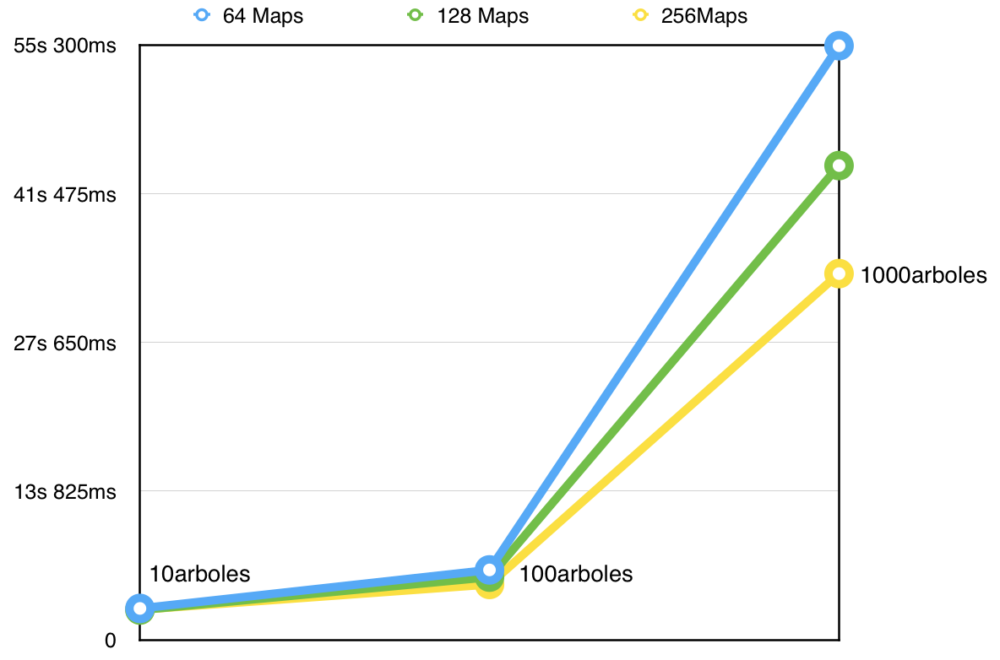
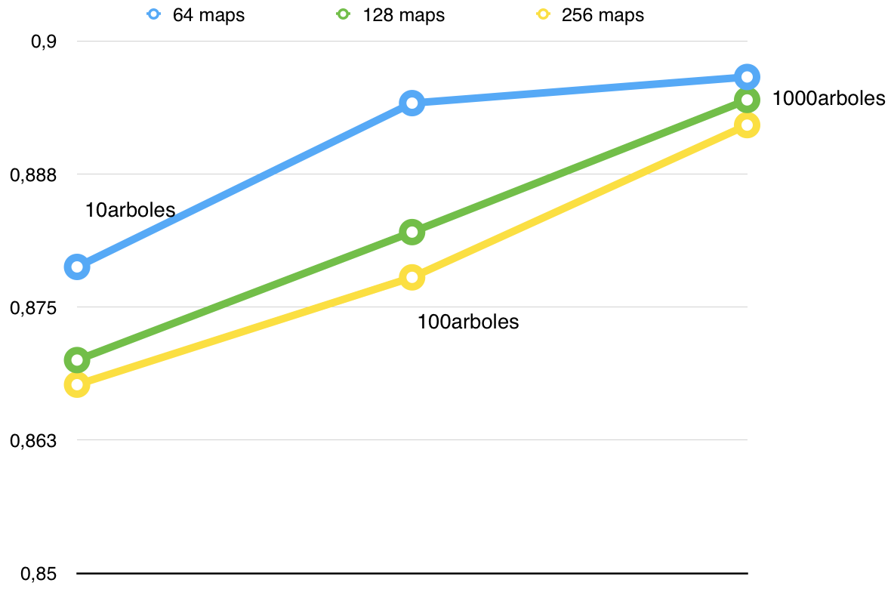
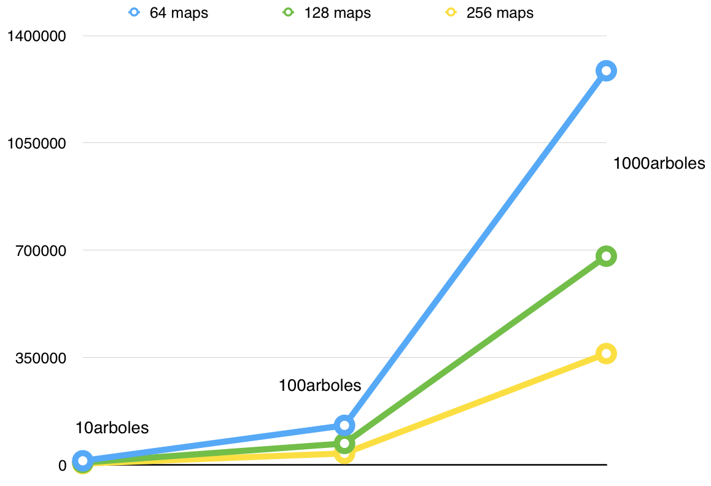

#Práctica 5

Ciencia de Datos con Hadoop

## Enunciado y objetivos. 

El objetivo de esta práctica es conocer las alternativas para realizar experimentaciones de Ciencia de Datos. Para ello, haremos uso del entorno que se ha convertido en un estándar de facto como es Hadoop, utilizando HDFS como sistema de archivos distribuido y Hadoop- MapReduce como mecanismo de ejecución. Por último, aplicaremos la biblioteca Mahout para lanzar algoritmos de clasificación sobre conjuntos tipo Big Data.

Los objetivos serán:

	
- Ejecutar el algoritmo “Random Forest” sobre el conjunto de datos BNG_heart y comprueba el rendimiento alcanzado de acuerdo a los siguientes casos:

	- Número de Maps: 64, 128, 256
	- Número de árboles: 10, 100, 1000

- Obtener una tabla de resultados sobre las combinaciones anteriores que contenga los siguientes datos:

	- Características del modelo: número de nodos (total y promedio), profundidad máxima del árbol.
	- Tiempo de ejecución para entrenamiento.
	-  Medidas de calidad Accuracy estándar y media geométrica tanto para la partición de entrenamiento como para test.

## Ejecución 

Para poner en marcha las baterías de pruebas, se ha creado un script bash que obtiene los parámetros por la entrada estándar y nos muestra la salida al finalizar para poder ir viendo como se comporta el modelo. Antes de poder ejecutarlo, hay que tener en cuenta que debemos traernos el dataset a nuestro espacio de usuario en el HDFS ya que de otro modo este nos dará error.  El [siguiente script](https://github.com/joseangeldiazg/MII-CCServicios-Apps/blob/master/P5/script.sh) usado es el siguiente:

	#! /bin/bash
	
	#Obtenemos el tamaño del fichero de entranamiento
	FILE_SIZE=( `hadoop fs -ls /user/ahilario/datasets/BNG_heart/BNG_heart-5-1tra.dat | awk '{print $5}'`)
	
	#Descriptor
	echo "Es la primera vez que creas el descriptor y/n"
	read des
	control="y"
	
	
	#Leemos el número de maps
	echo "Introduce el número de maps: "
	read MAPS
	
	#Leemos el número de trees
	echo "Introduce el número de árboles"
	read TREES
	
	typeset -i MAPS
	typeset -i TREES
	
	BYTES_BY_PARTITION=$(($FILE_SIZE/$MAPS))
	
	MAX_BYTES_BY_PARTITION=$(($BYTES_BY_PARTITION+1))
	
	salida="salida_rf_$TREES$MAPS"
	salida2="stats_$TREES$MAPS"
	
	
	DATAPATH="/user/mcc76139799/"
	DATASET="BNG_heart"
	
	if [ $control = $des ];
		then
			hadoop jar /tmp/mahout-distribution-sige.jar \
	 		org.apache.mahout.classifier.df.tools.Describe \
	 		-p $DATAPATH/$DATASET/$DATASET-5-1tra.dat \
	 		-f $DATASET.info -d N C 3 N 2 C N C N 3 C L;
	fi
	
	hadoop jar /tmp/mahout-distribution-sige.jar
	 org.apache.mahout.classifier.df.mapreduce.BuildForest \
	 -Dmapreduce.input.fileinputformat.split.minsize=$BYTES_BY_PARTITION \
	 -Dmapreduce.input.fileinputformat.split.maxsize=$MAX_BYTES_BY_PARTITION \
	 -o output_RF_${TREES}_${MAPS} \
	 -d $DATAPATH/$DATASET/$DATASET-5-1tra.dat \
	 -ds $DATASET.info \
	 -sl 13 -p -t $TREES;
	
	hadoop jar /tmp/mahout-distribution-sige.jar org.apache.mahout.classifier.df.mapreduce.TestForest \
	 -i $DATAPATH/$DATASET/$DATASET-5-1tst.dat \
	-ds $DATASET.info \
	-m output_RF_${TREES}_${MAPS} \
	-a -mr -o $salida2;

Una vez ejecutado, en la salida por terminal podremos encontrar los valores requeridos los cuales podemos encontrar en la siguiente tabla. 

## Tabla de resultados

| Maps | Arboles | nº nodos total | nº nodos promedio | profundidad máxima | t training | Acc Train  | Media Train | Acc Test   | Media Test |
|:----:|---------|:--------------:|-------------------|--------------------|------------|------------|-------------|------------|------------|
| 64   | 10      | 12755          | 1275              | 18                 | 2910ms     | 0.87549564 | 0.87549564  | 0,87876    | 0,87776    |
| 64   | 100     | 128343         | 1283              | 18                 | 6490ms     | 0,8986458  | 0,8976458   | 0,894145   | 0,894145   |
| 64   | 1000    | 1285247        | 1285              | 18                 | 55210ms    | 0,907864   | 0,907864    | 0,8966     | 0,89422704 |
| 128  | 10      | 6983           | 698               | 16                 | 2760ms     | 0,870909   | 0,879001    | 0,87000921 | 0,87000921 |
| 128  | 100     | 69456          | 694               | 15                 | 5820ms     | 0,88203    | 0,88203     | 0,88203    | 0,87962005 |
| 128  | 1000    | 680308         | 680               | 15                 | 44070ms    | 0,897445   | 0,897445    | 0,894445   | 0,89214368 |
| 256  | 10      | 3583           | 358               | 14                 | 2800ms     | 0,8689     | 0,867975    | 0,8677     | 0,86554533 |
| 256  | 100     | 36996          | 369               | 14                 | 5140ms     | 0,87778    | 0.87702736  | 0,87778    | 0,87602736 |
| 256  | 1000    | 362562         | 362               | 13                 | 34030ms    | 0,89208    | 0.88797009  | 0,89208    | 0,88997009 |
	
	
## Análisis de resultados
	
En este punto analizamos algunos puntos interesantes y a tener en cuenta del proceso.

### Tiempo

Uno de los factores más interesantes de analizar es la evolución del tiempo de ejecución en las distintas combinaciones de parámetros de entrada. En la siguiente tabla tenemos estas combinaciones: 

| Maps \ Arboles | 10       | 100      | 1000      |
|:--------------:|----------|----------|-----------|
| 64             | 2s 910ms | 6s 490ms | 55s 210ms |
| 128            | 2s 760ms | 5s 820ms | 44s 70ms  |
| 256            | 2s 800ms | 5s 140ms | 34s 30ms  |

Si obtenemos las gráficas de la anterior tabla, podemos constatar como el aumentar el número de procesos maps el tiempo comienza a reducirse drásticamente. Aquí podemos ver la potencia de Hadoop haciendo que computación distribuida que podría necesitar grandes tiempos aunque solo sean de gestión de hebras y procesos se comporte de manera muy eficiente. 

### Evaluación	

He querido obtener los valores de evaluación y compararlos unos con otro para ver como afecta el número de árboles a la correcta clasificación. Este factor, es un factor muy relevante en ciencia de datos cuando se trabaja con el algoritmo *Random Forest*. El resumen del valor de *acuraccy* en test podemos verlo en la siguiente tabla.

| Maps \ Arboles | 10         | 100      | 1000     |
|:--------------:|------------|----------|----------|
| 64             | 0,87876    | 0,894145 | 0,8966   |
| 128            | 0,87000921 | 0,88203  | 0,894445 |
| 256            | 0,8677     | 0,87778  | 0,89208  |

Pasando estos valores a el gráfico, podemos constatar como a más árboles el valor de accuracy parece ir aumentando. La literatura, sitúa este valor en valores superiores de 100, y hasta 4048 en algunos experimentos, obteniendo en estos puntos los mejores valores de. Si comparamos nuestros resultados vemos como a raíz de 100 árboles comenzamos a obtener resultados similares a los 1000, pero cabria la posibilidad de probar con mas para comprobar hasta donde la tendencia se mantiene.  

### Características

Por último se han analizado las características del proceso. En la siguiente tabla tenemos el resumen de nodos por map y trees. 

| Maps \ Arboles | 10    | 100    | 1000    |
|:--------------:|-------|--------|---------|
| 64             | 12755 | 128343 | 1285247 |
| 128            | 6983  | 69456  | 680308  |
| 256            | 3583  | 36996  | 362562  |

Pasando la tabla a gráfico, es interesante ver como los nodos se reducen en comparación al número de maps, llegando a haber diferencias muy elevadas y una tendencia claramente mucho más inclinada en valores bajos de maps frente a los altos.  

	
## Conlusiones		

Con esta última práctica de la asignatura hemos dejado constatado lo que comprobamos en la anterior donde vimos la potencia de Hadoop para manejar grandes conjuntos de datos. Ahora, en conjunción con Mahout, la potencia de este se exprime al máximo para el procesado de grandes conjuntos de datos y datasets que de otro modo serían imposibles de manejar. Queda clara por tanto la gran relevancia de estas tecnologías en el mundo actual donde los datos y su conocimiento están cambiando la práctica totalidad de las actividades económicas o sociales. 